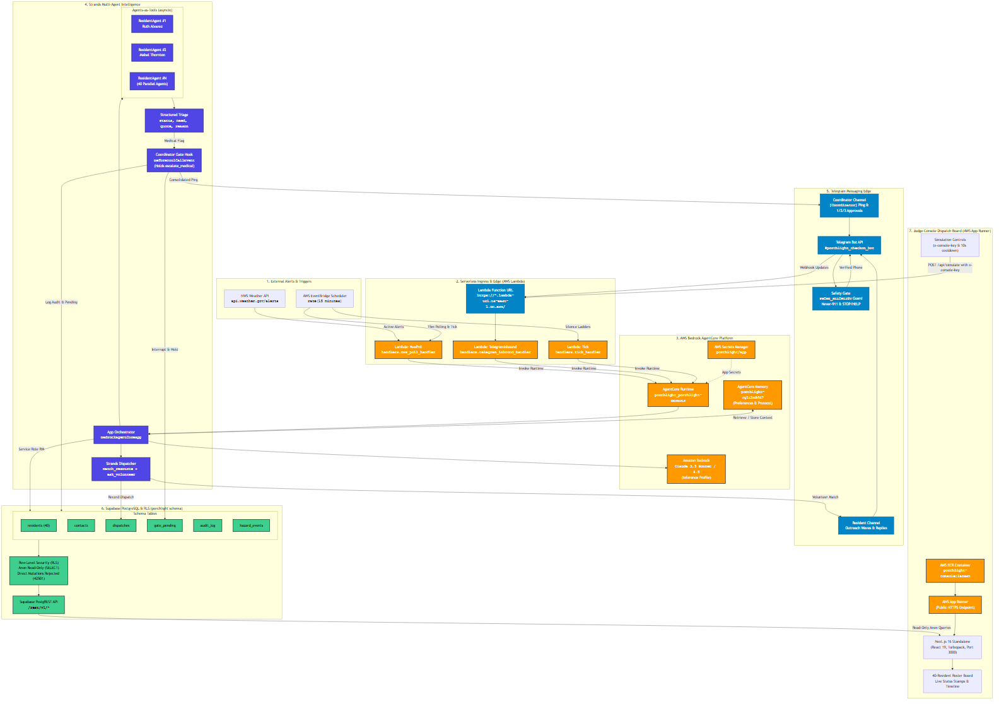

# Porchlight

> Extreme-weather wellness check-in agent for neighborhood "check on" rosters powered by Strands Agents and AWS Bedrock AgentCore.

In an extreme heat wave or winter freeze, the people who die are older, alone, and on somebody's list. Mutual-aid groups, block associations, congregations, and senior centers maintain rosters of vulnerable neighbors, but a single volunteer coordinator cannot manually text dozens of residents, interpret ambiguous replies, coordinate volunteer drivers, and track escalations when disaster strikes.

**Porchlight works the list**: when a National Weather Service (NWS) alert drops, Porchlight texts every vulnerable neighbor on the roster, triages natural language responses, dispatches volunteer help to cooling centers, and interrupts execution to alert the human coordinator only for decisions a human must make.

---

## Architecture & System Flow

Porchlight combines AWS Bedrock AgentCore serverless infrastructure with the Strands Agents framework, Telegram messaging edge, Supabase PostgreSQL with Row Level Security, and a Next.js operator dispatch console.



```text
[ NWS Weather API ] ──> [ AWS EventBridge (15m) ] ──> [ Lambda: NwsPoll ]
                                                             │
                                                             ▼
[ Telegram Bot API ] <──> [ Lambda: TelegramInbound ] ──> [ AgentCore Runtime ]
                                                             │
                                   ┌─────────────────────────┴─────────────────────────┐
                                   ▼                                                   ▼
                       [ Strands: ResidentAgents ]                            [ Strands: CoordinatorGate ]
                     (Agents-as-Tools per resident)                         (BeforeToolCallEvent Hook)
                                   │                                                   │
                                   ▼                                                   ▼
                         [ Structured Triage ]                                 [ gate_pending Queue ]
                                   │                                                   │
                                   └─────────────────────────┬─────────────────────────┘
                                                             │
                                                             ▼
                                                [ Supabase PostgreSQL + RLS ]
                                                             │
                                                             ▼
                                              [ Next.js Console Dispatch Board ]
                                                    (AWS App Runner / ECR)
```

### End-to-End Operational Lifecycle

1. **Hazard Detection**: AWS EventBridge invokes the `NwsPoll` Lambda every 15 minutes to poll `api.weather.gov`. When a warning activates for the configured zone, it triggers the AgentCore Runtime with `hazard.detected`.
2. **Outreach Wave**: Porchlight loads the resident roster from Supabase, prioritizes by vulnerability score (Tiers 1–3), and dispatches personalized, bilingual check-in messages via Telegram.
3. **Inbound Resident Triage**: Incoming messages route through `TelegramInbound` into isolated `ResidentAgent` instances (one per resident). Clear check-ins (`"1"`) short-circuit instantly, while conversational or distress replies are analyzed using Claude 3.5 Sonnet on Bedrock into a structured `Triage` record (`status`, `need`, `quote`, `reason`).
4. **Coordinator Human Gate**: When a reply indicates medical urgency or power disruption, Strands `BeforeToolCallEvent` hook interrupts the automated tool call, saves the action to `gate_pending`, and alerts the coordinator via Telegram with a consolidated summary and numbered options.
5. **Volunteer Dispatch & Scheduling**: When the coordinator approves an option (`"1"`), the Strands Dispatcher matches the nearest open cooling center, queries verified volunteers, sends an ask to volunteer Marcus Webb, and logs the accepted dispatch with Google Calendar integration.
6. **Live Visibility**: The Next.js 16 dispatch board renders active hazard banners, tier counts, 40-resident status stamps, conversation views, and audit timeline updates under anonymous read-only PostgREST RLS.

---

## Safety & Ethics Architecture

Porchlight is engineered with defense-in-depth safety guardrails designed for real-world vulnerable populations:

- **Strict `PHONE_ALLOWLIST` Enforcement**: In synthetic mode (`ROSTER_MODE=synthetic`), every resident, volunteer, and emergency contact number is asserted against `PHONE_ALLOWLIST` before any SMS or Telegram message is sent. Any non-allowlisted number instantly aborts execution with zero outbound sends.
- **Never-911 Policy**: No tool or capability to call emergency services (911) exists anywhere in the codebase. Medical escalations terminate at the designated family or neighbor emergency contact with clear advisory copy (*"please check on them; if you can't reach them, call 911"*).
- **Mandatory Opt-Out Compliance**: The initial check-in message to every resident carries explicit opt-out instructions (*"Reply STOP to opt out"*). Inbound keywords `STOP`, `UNSTOP`, and `HELP` are handled deterministically at the edge, immediately updating resident status and suppressing further outreach.
- **Consent & Data Model**: Porchlight operates exclusively on pre-enrolled community rosters where residents have registered with their coordinator. The schema stores minimal necessary PII (first name, phone, age band, mobility tier, emergency contact), enforces an explicit opt-in/opt-out lifecycle, and isolates anonymous database access behind PostgREST Row Level Security (RLS) with all mutations restricted to server-side credentials.
- **Synthetic Roster Model**: The default roster consists of 40 synthetic residents reflecting realistic demographic diversity across languages (English and Spanish), age brackets (65+ to 85+), mobility limitations, and power-dependent medical devices.
- **Liability-Grade Audit Trail**: Every inbound response, model triage classification, gate interruption, coordinator decision, and dispatch confirmation is immutably written to Supabase `audit_log` with millisecond UTC timestamps.

---

## Strands Framework Integration

Porchlight leverages the full capability spectrum of the Strands Agents framework:

| Strands Feature | Implementation in Porchlight | File Reference |
| --- | --- | --- |
| **Agents-as-Tools** | One `ResidentAgent` per resident executed concurrently with `asyncio.gather` for parallel multi-resident triage. | `agent/inbound.py` |
| **Structured Output** | Strict Pydantic models (`Triage`, `Dispatch`) enforce deterministic classification schemas and prevent hallucinated fields. | `agent/models.py`, `agent/triage.py` |
| **Hooks & Interrupts** | `CoordinatorGate` implements `HookProvider` listening on `BeforeToolCallEvent` to hold `escalate_medical` and interrupt execution with `"coordinator-decision"`. | `agent/coordinator.py` |
| **Session Managers** | Long-running hazard session management passing `runtimeSessionId="porchlight-{event_id}-{suffix}"` across invocations. | `agent/app.py`, `lambda/handlers.py` |
| **AgentCore Memory** | Episodic memory integration across hazard days for resident cooling preferences and organization protocol rules. | `agent/app.py`, `agentcore/agentcore.json` |
| **Bedrock Models** | Native `BedrockModel` abstraction connecting Claude 3.5 Sonnet / 4.5 via inference profiles with temperature zero. | `agent/triage.py`, `agent/dispatch.py` |

---

## AWS Bedrock AgentCore Services

| AgentCore Service | Architecture Role | Configuration / Deployment |
| --- | --- | --- |
| **AgentCore Runtime** | Long-running microVM environment executing the core `BedrockAgentCoreApp` with entrypoint `agent/app.py`. | `agentcore/agentcore.json` (`porchlight` runtime, `CodeZip`) |
| **AgentCore Memory** | Episodic memory retention across hazard days for resident cooling preferences and organization protocol rules. | Resource `porchlight-Jg1L1m9fd7` (`bedrock-agentcore-control`) |
| **AWS Lambda Glue** | Three lightweight serverless shims: `NwsPoll`, `TelegramInbound` (with Function URL), and `Tick` (retry ladders). | `sam/template.yaml`, `lambda/handlers.py` |
| **AWS Secrets Manager** | Centralized production secret store containing Supabase keys, Telegram tokens, and console credentials. | Secret `porchlight/app` |
| **Amazon ECR** | Container registry hosting multi-stage Alpine Docker image for the Next.js standalone dispatch console. | ECR Repository `porchlight-console` |
| **AWS App Runner** | Managed container hosting service exposing public HTTPS endpoint for the operator console. | Service `porchlight-console` |
| **Amazon EventBridge** | Serverless scheduler driving the 15-minute weather poller and retry/silence check cron schedules. | Schedules `NwsPollSchedule`, `TickSchedule` |

---

## Triage Benchmark Evals

Porchlight's triage intelligence is validated against a benchmark of 30 adversarial real-world replies (`evals/replies/cases.json`), including figurative speech (*"I'm dying for some ice cream"*), understated distress (*"Mom hasn't gotten up today"*), Spanish idioms, typos, and STOP/HELP commands.

### Results Benchmark

| Metric | Target Threshold | Run 7 Result | Status |
| --- | --- | --- | --- |
| **Status Classification** | >= 27 / 30 (90%) | **27 / 30** | **PASS** |
| **Need Identification** | >= 26 / 30 (87%) | **26 / 30** | **PASS** |
| **Quote Grounding** | = 30 / 30 (100%) | **30 / 30** | **PASS** |
| **Deterministic Judge Pass** | >= 27 / 30 (90%) | **29 / 30** | **PASS** |

Full run progression and failure mode analysis are documented in `docs/evals.md` and `evals/results/`.

---

## Quickstart & Local Verification

### Prerequisites

- Python 3.12+ (tested on Python 3.12 and 3.13)
- Node.js 20+ and npm
- Supabase account with PostgreSQL schema `porchlight`
- Telegram account and bot token via `@BotFather`

### 1. Installation

Clone the repository and install dependencies:

```bash
git clone https://github.com/your-org/porchlight.git
cd porchlight

# Set up Python virtual environment
python -m venv .venv
source .venv/bin/activate  # On Windows: .venv\Scripts\activate
pip install -r requirements.txt

# Install Console dependencies
cd console
npm install
cd ..
```

### 2. Environment Configuration

Copy the example environment file and configure your credentials:

```bash
cp .env.example .env
```

Ensure the following variables are defined in `.env`:

```ini
BEDROCK_MODEL_ID=us.anthropic.claude-3-5-sonnet-20241022-v2:0
AWS_REGION=us-east-1
SUPABASE_URL=https://<your-project>.supabase.co
SUPABASE_SERVICE_KEY=<your-service-role-key>
SUPABASE_ANON_KEY=<your-anon-key>
TELEGRAM_BOT_TOKEN=<your-telegram-bot-token>
TELEGRAM_OWNER_CHAT_ID=<your-telegram-chat-id>
OWNER_PHONE=+1555010001
PHONE_ALLOWLIST=+1555010001,+1555010000,...,+1555010999
ROSTER_MODE=synthetic
DEMO_ZONE=ARZ001
CONSOLE_KEY=porchlight-console-demo-key
```

### 3. Database Reset & Health Probe

Run the idempotent reset script to close active events, purge stale records, reseed 40 synthetic residents, and verify health across all subsystems:

```bash
python scripts/reset_demo.py
```

Expected output:

```text
PROOF P-08: reset_demo ok runtime=READY lambdas=3/3 console=200 telegram=ok = PASS
```

### 4. Run Automated Dress Rehearsal

Execute the end-to-end dress rehearsal verifying alert injection, wave dispatch, resident reply triage, coordinator human gate, and volunteer dispatch:

```bash
python scripts/rehearsal_p08.py
```

Expected output:

```text
PROOF P-08: rehearsal — Ruth text received; "1" → ok; Alvarez medical → coordinator text received; reply 1 → volunteer Y → dispatch + calendar; timestamps printed; zero sends outside the allowlist = PASS
```

### 5. Launch the Operator Dispatch Board

Build and run the Next.js standalone console:

```bash
cd console
npm run build
node .next/standalone/server.js
```

Open `http://localhost:3000` to view the live dispatch board, active hazard banner, tier badges, resident conversations, and interactive simulation panel.

### 6. Run the Test Suite

Run the full offline unit and regression test suite:

```bash
pytest
```

All 141 tests pass with zero external messaging dependencies.

---

## Deployment Guide

### Deploy Lambda Glue with AWS SAM

Deploy the three serverless Lambda functions and EventBridge schedules:

```bash
cd sam
sam build
sam deploy --guided
```

### Deploy Console to AWS App Runner

Build the container image and deploy to AWS App Runner via Amazon ECR:

```bash
# Authenticate Docker to Amazon ECR
aws ecr get-login-password --region us-east-1 | docker login --username AWS --password-stdin <account-id>.dkr.ecr.us-east-1.amazonaws.com

# Build and push container image
cd console
docker build -t porchlight-console:latest .
docker tag porchlight-console:latest <account-id>.dkr.ecr.us-east-1.amazonaws.com/porchlight-console:latest
docker push <account-id>.dkr.ecr.us-east-1.amazonaws.com/porchlight-console:latest

# Deploy or update App Runner service
python scripts/deploy_apprunner.py --check-aws
```

---

## License

This project is licensed under the terms of the [MIT License](LICENSE).
